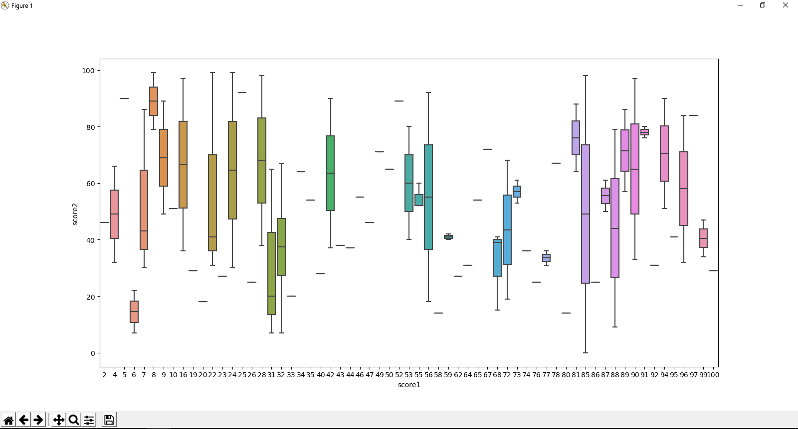
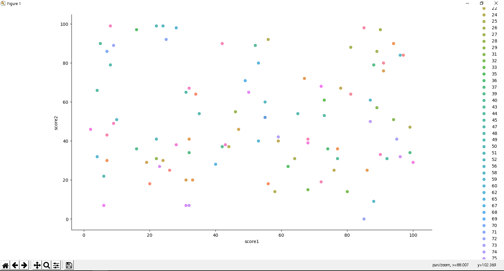
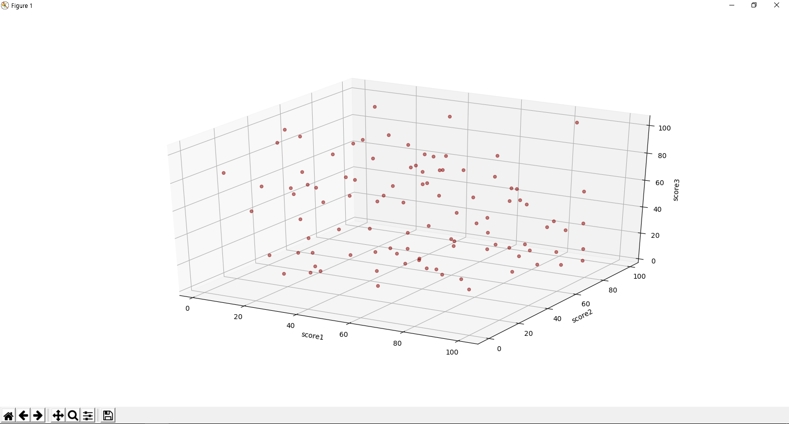
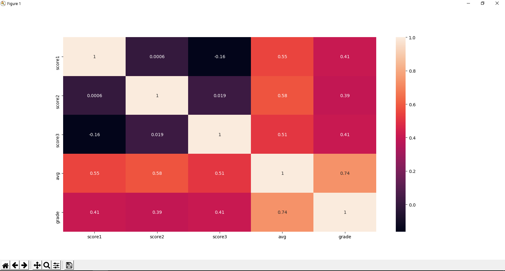
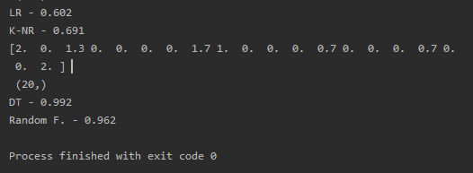

# 컴퓨터공학전공 인공지능 최종과제  
## 성적을 통한 평점 예측하기  
※ https://github.com/yungbyun/mllib/prediction_util.py 의 코드를 바탕으로 만들었습니다.


```gildong.boxplot('score1','score2')```  


```gildong.lmplot('score1','score2','score3')```


```gildong.plot_3d('score1','score2','score3')```


```gildong.heatmap(['score1','score2','score3','avg','grade'])```


```gildong.run_all(['score1','score2','score3','avg'],'grade')```


- **선형회귀 모형** : 60.2%  
- **K-NN 알고리즘** : 69.1%  
- **결정트리 알고리즘** : 99.2%  
- **랜덤 포레스트 알고리즘** : 96.2%  
